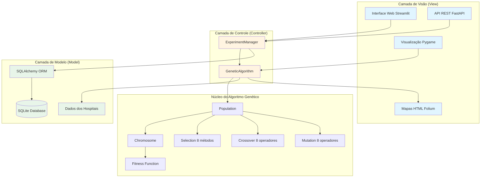
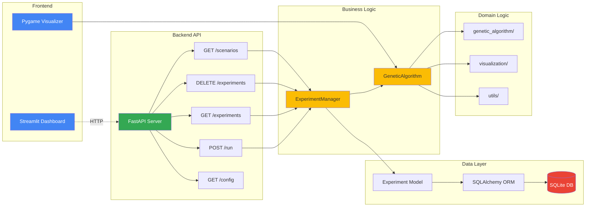
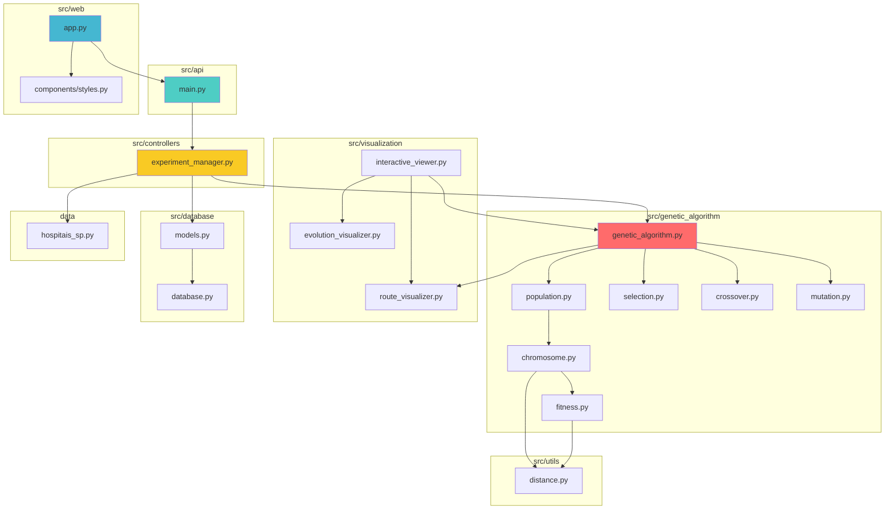
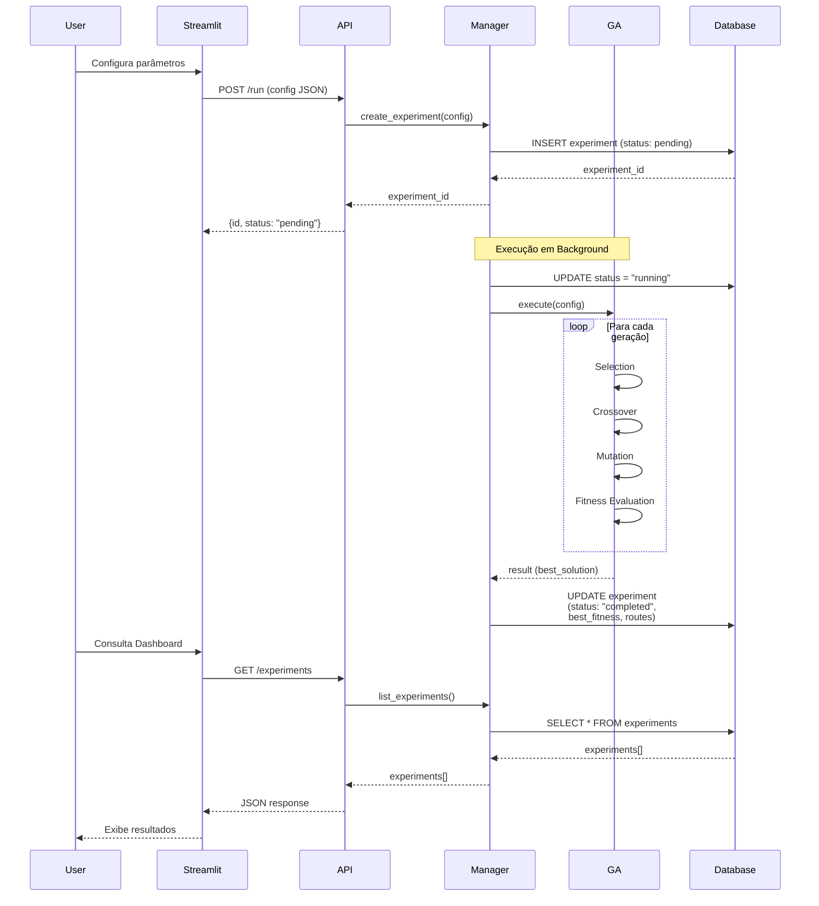
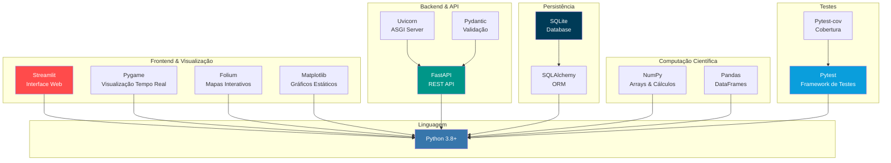
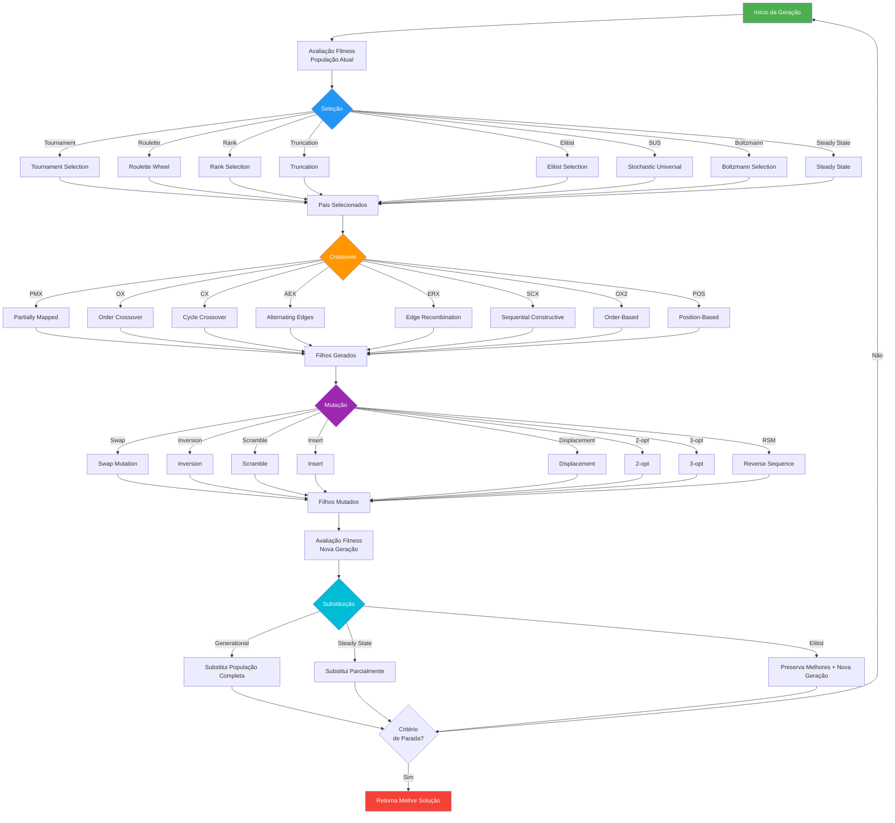
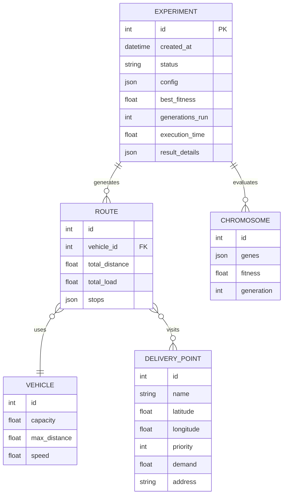
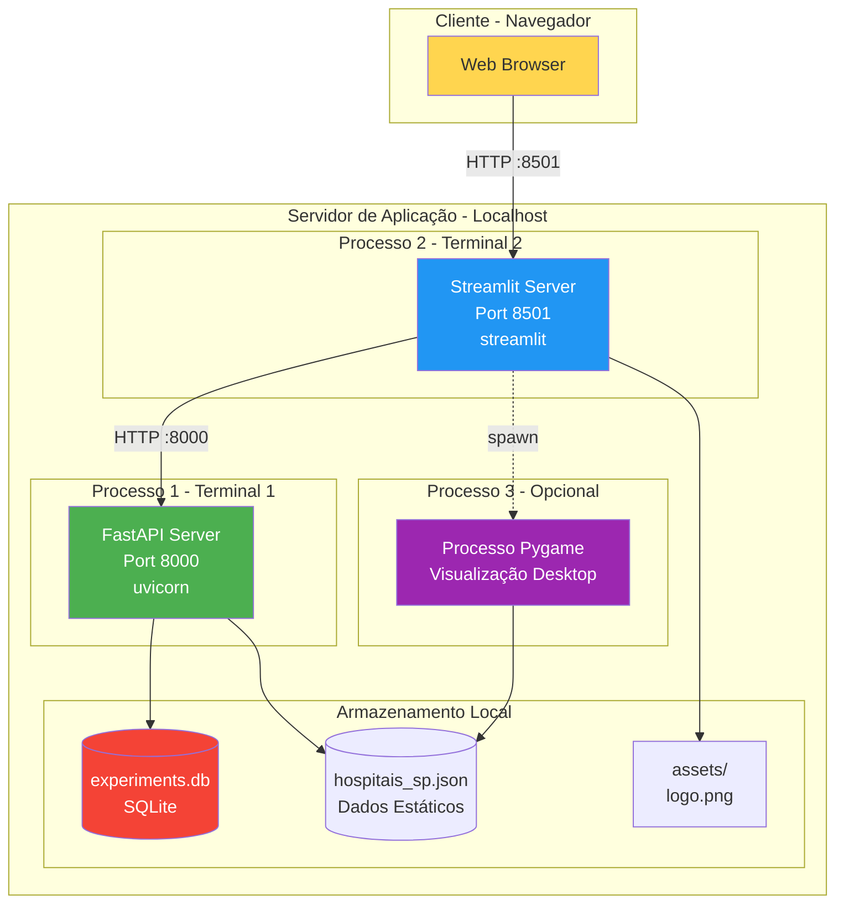
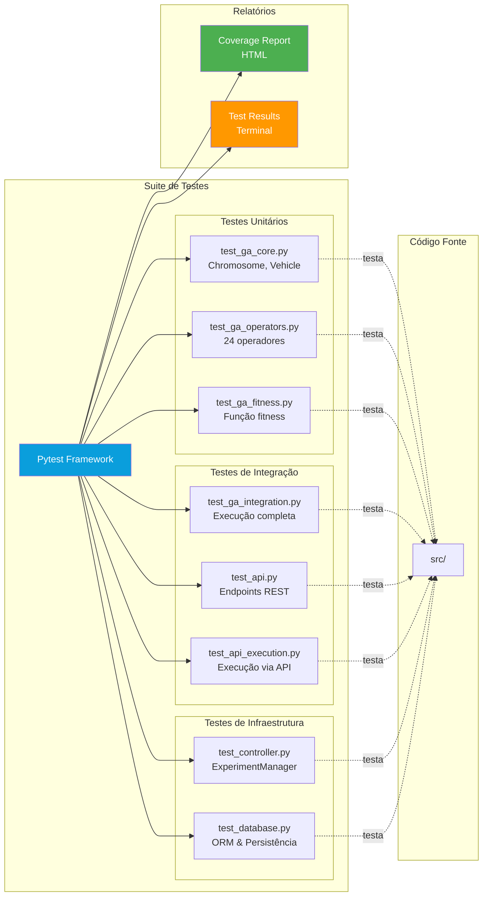

# Arquitetura do Sistema - Saudelog

Este documento apresenta a arquitetura completa do sistema de otimização de rotas utilizando diagramas Mermaid.

## 1. Visão Geral da Arquitetura MVC

## 2. Arquitetura Detalhada de Componentes

## 3. Estrutura de Módulos e Dependências

## 4. Fluxo de Dados - Execução de Experimento

## 5. Stack Tecnológico

## 6. Fluxo de Operadores Genéticos

## 7. Modelo de Dados

## 8. Ciclo de Vida do Experimento

```mermaid
stateDiagram-v2
    [*] --> Pending: Experimento criado

    Pending --> Running: Iniciar execução

    Running --> Initializing: Criar população inicial
    Initializing --> Evolving: População criada

    Evolving --> Evaluating: Calcular fitness
    Evaluating --> Selecting: Fitness calculado
    Selecting --> Crossing: Pais selecionados
    Crossing --> Mutating: Filhos criados
    Mutating --> Replacing: Mutação aplicada
    Replacing --> Evolving: Nova geração criada

    Evolving --> Converged: Critério de parada
    Converged --> Completed: Salvar resultados

    Running --> Failed: Erro ocorreu

    Completed --> [*]
    Failed --> [*]

    note right of Evolving
        Loop executado por
        max_generations ou
        até stagnation_limit
    end note

    note right of Completed
        - best_fitness salvo
        - routes persistidas
        - execution_time registrado
    end note
```

## 9. Arquitetura de Deployment

## 10. Estrutura de Testes

## Resumo da Arquitetura

### Camadas Principais

1. **Camada de Apresentação (View)**
   - Interface Web Streamlit (Dashboard, Configuração, Análise)
   - Visualização em Tempo Real Pygame
   - Mapas Interativos Folium
   - API REST FastAPI

2. **Camada de Lógica de Negócio (Controller)**
   - ExperimentManager: Orquestra experimentos e persistência
   - GeneticAlgorithm: Implementa o algoritmo genético completo

3. **Camada de Domínio**
   - 24 Operadores Genéticos (8 seleção + 8 crossover + 8 mutação)
   - Função de Fitness Multi-objetivo
   - Representação de Cromossomos e População

4. **Camada de Dados (Model)**
   - SQLAlchemy ORM
   - SQLite Database
   - Modelo Experiment
   - Dados estáticos dos hospitais

### Tecnologias Principais

- **Backend**: Python 3.8+, FastAPI, Uvicorn
- **Frontend**: Streamlit, Pygame
- **Visualização**: Folium, Matplotlib
- **Persistência**: SQLAlchemy, SQLite
- **Computação**: NumPy, Pandas
- **Testes**: Pytest, pytest-cov
- **Validação**: Pydantic

### Fluxos Principais

1. **Fluxo de Criação de Experimento**: User → Streamlit → API → Manager → Database
2. **Fluxo de Execução**: Manager → GA → Operadores Genéticos → Resultado
3. **Fluxo de Visualização**: GA → Pygame/Folium → User
4. **Fluxo de Consulta**: User → Streamlit → API → Database → Response

### Características de Qualidade

- **Modularidade**: Separação clara de responsabilidades
- **Extensibilidade**: Novos operadores podem ser adicionados facilmente
- **Testabilidade**: 8 suites de teste cobrindo todas as camadas
- **Escalabilidade**: Execução assíncrona e background tasks
- **Persistência**: Histórico completo de experimentos
- **Usabilidade**: Múltiplas interfaces para diferentes casos de uso
